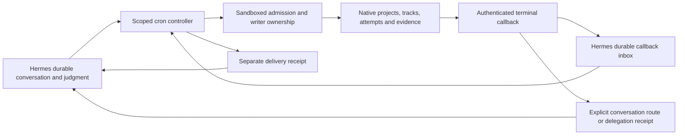

# Controller progression review

## Ownership and execution path

Hermes stores conversation history, controller configuration, callback input and
delivery bookkeeping. Native Sandboxed stores own project/track progress,
supersession, writer admission and accepted evidence. Hermes project-session
routes identify a conversation; they are not a second writable project roadmap.
No new model tool, project store, polling worker or writer is introduced here.

## Reproduced defects and changes

1. **Admission happened too late.** A job update accepted a 21,614-character
   stored prompt or a 160,000-character skill preload, then every execution
   failed the 16,000-character assembled-prompt gate. Creation and relevant
   edits now validate the merged controller definition before saving. Validation
   uses the existing assembler, including controller/cron framing and full
   skill/bundle contents, without executing scripts/inline shell, recording
   skill usage or installing cache boundaries. It does not truncate instructions
   or change authority. Damaged legacy jobs can still be paused and repaired.
   Dynamic output and template expansion are checked again at runtime; static
   admission is not a promise that future external input will fit.

2. **Callback bursts ignored available prompt space.** A fixed callback batch
   could overflow an otherwise valid controller. Runtime now assembles mandatory
   content once, then selects whole callback records within the actual remaining
   capacity, including framing. Unselected records remain pending. If even one
   record cannot fit, preparation fails explicitly and retains input rather than
   dropping constraints or silently acknowledging evidence.

3. **Pending failures defeated the schedule.** Replaying the same terminal
   callback moved a failed controller's next run to every scheduler tick.
   Replays now preserve its ordinary retry time; genuinely new evidence can wake
   it early. An incomplete but deliverable model summary also defers its captured
   callbacks to the normal cadence. Explicit pause/terminal states remain in
   force. No job is cancelled or automatically rewritten.

4. **Attempt callbacks wrote project state.** Every failed callback emitted a
   native `CTRL` blocked marker, even if the attempt had been superseded.
   Callback formatting now records attempt evidence without project-state or
   decision markers, including markers quoted in worker output. It retains
   failure diagnostics and projects the native `superseded_by:<UUID>` tag.
   A duplicate event can acquire newer relationship metadata without creating
   a second dispatch identity or refreshing its original arrival timestamp.

5. **The notification prompt encouraged unsupported assurances.** It asked
   whether action was needed while forbidding inspection and asserting that a
   controller owned follow-up. It now distinguishes a declared successor from
   verified live execution and forbids promises of rerouting/no-action based
   merely on a controller's existence. Actionable failures remain visible.
   The native callback currently supplies relationship tags but no verified
   successor execution snapshot. Hermes therefore does not manufacture live
   replacement status from a tag, a backend name or dispatch acceptance.

## Reviewed invariants and remaining boundaries

- **Cached prefix:** existing skill prefixes remain stable across runs; callback
  evidence is appended after the assembled instruction prefix. Admission does
  not register cache boundaries or rewrite any existing conversation.
- **Provider selection:** the scheduler resolves explicit job pins ahead of
  cron defaults and global configuration. Unpinned axes with snapshots are
  checked for drift; legacy axes without snapshots retain compatibility behavior.
  Configured fallback entries change provider and model together after eligible
  authentication/transient resolution errors. A provider label does not prove
  account availability, native session authentication or useful tool execution.
- **Run versus delivery:** `mark_job_run` distinguishes agent failure from
  `delivery_failed`; execution records and delivery queue receipts must be read
  alongside `last_status`. A callback ACK means a completed controller processed
  its snapshot, not that a native proof was accepted or a message reached the
  operator. Moving ACK after delivery would replay already executed controller
  actions on a transport failure. The existing delivery queue uses independent
  claims and records unknown outcomes rather than blindly resending.
- **Routing:** project routes are explicit, follow compression continuations,
  reopen only designated accidental closures and do not choose the most recent
  unrelated conversation. Origin stamping uses trusted session context, refuses
  ephemeral cron identities and does not enroll controller ticks as conversational
  delegations. Callback/delegation dedupe and scheduler claims retain their
  existing sole-dispatch roles. Native admission remains responsible for writer
  exclusivity; no claim here proves external infrastructure execution.
- **Supersession versus acceptance:** a supersession tag identifies a replacement
  relationship. It does not accept a proof, terminate an unresolved runner or
  establish successor health. The controller must read native state before
  reporting recovery or dispatching a writer. Historical receipts remain intact.

## Native interface findings for the Sandboxed owner

Read-only source review of `src/api/control/mod.rs`, `mission_horizon.rs`,
`controller_honesty.rs`, `hermes_control_route.rs` and
`docs/writer-dispatch-admission.md` confirms that callbacks include execution
identity, terminal reason/evidence, remote jobs, origin/wake routing and tags.
Writer admission explicitly separates presentation status from unresolved
execution ownership. This PR does not edit those implementations.

The reported host workspace early-ready/ENOENT condition, invalid native Claude
profile, native Grok authentication-context failure despite a working container
Grok session, unreported Fable weekly quota, and repeated large event byte arrays
are native-layer findings supplied by the operator. They have not been reproduced
against live infrastructure by this Hermes checkout. Relevant interface outcomes:

- Workspace readiness must mean the working directory exists before disk
  admission; Hermes should not bypass admission or create an SSH harness.
- Resolve profile names and provider/account injection per native execution.
  One host authentication failure is not evidence that all Grok accounts or
  container sessions are unavailable.
- Health should expose quota exhaustion and its reset time separately from
  authentication and process liveness.
- Event APIs should offer compact evidence references instead of repeatedly
  returning enormous byte arrays. Do not preload those arrays into controllers.
- A replacement notification needs a same-project successor identity plus
  current execution evidence and observation time. A supersession pointer alone
  must remain explicitly unverified.

## Validation scope

Tests use real imports, temporary Hermes homes, job stores, SQLite routes and
callback ledgers. Model/provider and transport boundaries use local doubles;
there are no live inference calls or production migrations. Regression tests
first failed on the original admission, batching, repeated-failure scheduling
and callback-state behavior. Run via `scripts/run_tests.sh` with the locked
`dev` and `messaging` extras. No merge, deployment, restart, campaign edit or
native mission intervention is part of this change.
