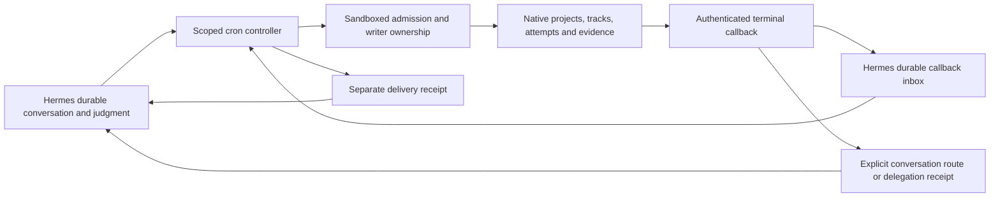

# Controller progression review

## Ownership and execution path



Hermes stores conversation history, controller configuration, callback input and
delivery bookkeeping. Native Sandboxed stores own project/track progress,
supersession, writer admission and accepted evidence. Hermes project-session
routes identify a conversation; they are not a second writable project roadmap.
No new model tool, project store, polling worker or writer is introduced here.

## Reproduced defects and changes

1. **Admission happened too late.** A job update accepted a 21,614-character
   stored prompt or a 160,000-character skill preload, then every execution
   failed the 16,000-character assembled-prompt gate. Creation and relevant
   edits now validate the merged controller definition before saving. Validation
   uses the existing assembler, including controller/cron framing and full
   skill/bundle contents, without executing scripts/inline shell, recording
   skill usage or installing cache boundaries. It does not truncate instructions
   or change authority. Damaged legacy jobs can still be paused and repaired.
   Dynamic output and template expansion are checked again at runtime; static
   admission is not a promise that future external input will fit.

2. **Callback bursts ignored available prompt space.** A fixed callback batch
   could overflow an otherwise valid controller. Runtime now assembles mandatory
   content once, then selects whole callback records within the actual remaining
   capacity, including framing. Unselected records remain pending. If even one
   record cannot fit, preparation fails explicitly and retains input rather than
   dropping constraints or silently acknowledging evidence.

3. **Pending failures defeated the schedule.** Replaying the same terminal
   callback moved a failed controller's next run to every scheduler tick.
   Replays now preserve its ordinary retry time; genuinely new evidence can wake
   it early. An incomplete but deliverable model summary also defers its captured
   callbacks to the normal cadence. Explicit pause/terminal states remain in
   force. No job is cancelled or automatically rewritten.

4. **Attempt callbacks wrote project state.** Every failed callback emitted a
   native `CTRL` blocked marker, even if the attempt had been superseded.
   Callback formatting now records attempt evidence without project-state or
   decision markers, including markers quoted in worker output. It retains
   failure diagnostics and projects the native `superseded_by:<UUID>` tag.
   A duplicate event can acquire newer relationship metadata without creating
   a second dispatch identity or refreshing its original arrival timestamp.

5. **The notification prompt encouraged unsupported assurances.** It asked
   whether action was needed while forbidding inspection and asserting that a
   controller owned follow-up. It now distinguishes a declared successor from
   verified live execution and forbids promises of rerouting/no-action based
   merely on a controller's existence. Actionable failures remain visible.
   The native callback supplies relationship tags but no verified successor
   execution snapshot. The route reads both prior and successor through the
   existing `sandboxed_assistant` digest tool when registered, validates exact
   identity/project, and requires a running/tool-waiting execution with a fresh
   (at most 60 seconds old) heartbeat before stamping an observation time and
   run identity. Missing tools, reads, execution, stale heartbeats and ownership
   conflicts remain unverified. Callback-supplied verification fields are ignored.

6. **Compression consumed a notification without waking.** The webhook used to
   append during a compression lock, skip the wake and acknowledge transport;
   a retry then looked like an already delivered event. It now checks the lock
   before appending and returns HTTP503, releasing transport dedupe for an exact
   retry. Controller callbacks retain their independent durable inbox handoff.
   The lock check is an observation, not a transaction spanning compression and
   the later model turn; asynchronous post-wake transport failure recovery remains
   a separate boundary from this pre-append refusal.

## Reviewed invariants and remaining boundaries

- **Cached prefix:** existing skill prefixes remain stable across runs; callback
  evidence is appended after the assembled instruction prefix. Admission does
  not register cache boundaries or rewrite any existing conversation.
- **Provider selection:** the scheduler resolves explicit job pins ahead of
  cron defaults and global configuration. Unpinned axes with snapshots are
  checked for drift; legacy axes without snapshots retain compatibility behavior.
  Configured fallback entries change provider and model together after eligible
  authentication/transient resolution errors. A provider label does not prove
  account availability, native session authentication or useful tool execution.
- **Run versus delivery:** `mark_job_run` distinguishes agent failure from
  `delivery_failed`; execution records and delivery queue receipts must be read
  alongside `last_status`. A callback ACK means a completed controller processed
  its snapshot, not that a native proof was accepted or a message reached the
  operator. Moving ACK after delivery would replay already executed controller
  actions on a transport failure. The existing delivery queue uses independent
  claims and records unknown outcomes rather than blindly resending.
- **Routing:** project routes are explicit, follow compression continuations,
  reopen only designated accidental closures and do not choose the most recent
  unrelated conversation. Origin stamping uses trusted session context, refuses
  ephemeral cron identities and does not enroll controller ticks as conversational
  delegations. Callback/delegation dedupe and scheduler claims retain their
  existing sole-dispatch roles. Native admission remains responsible for writer
  exclusivity; no claim here proves external infrastructure execution.
- **Supersession versus acceptance:** a supersession tag identifies a replacement
  relationship. It does not accept a proof, terminate an unresolved runner or
  establish successor health. The controller must read native state before
  reporting recovery or dispatching a writer. Historical receipts remain intact.

## Native interface findings for the Sandboxed owner

Read-only source review of `src/api/control/mod.rs`, `mission_horizon.rs`,
`controller_honesty.rs`, `hermes_control_route.rs` and
`docs/writer-dispatch-admission.md` confirms that callbacks include execution
identity, terminal reason/evidence, remote jobs, origin/wake routing and tags.
Writer admission explicitly separates presentation status from unresolved
execution ownership. This PR does not edit those implementations.

The reported host workspace early-ready/ENOENT condition, invalid native Claude
profile, native Grok authentication-context failure despite a working container
Grok session, unreported Fable weekly quota, and repeated large event byte arrays
are native-layer findings supplied by the operator. They have not been reproduced
against live infrastructure by this Hermes checkout. Relevant interface outcomes:

- Workspace readiness must mean the working directory exists before disk
  admission; Hermes should not bypass admission or create an SSH harness.
- Resolve profile names and provider/account injection per native execution.
  One host authentication failure is not evidence that all Grok accounts or
  container sessions are unavailable.
- Health should expose quota exhaustion and its reset time separately from
  authentication and process liveness.
- Event APIs should offer compact evidence references instead of repeatedly
  returning enormous byte arrays. Do not preload those arrays into controllers.
- A replacement notification needs a same-project successor identity plus
  current execution evidence and observation time. A supersession pointer alone
  must remain explicitly unverified.

## Validation scope

Tests use real imports, temporary Hermes homes, job stores, SQLite routes and
callback ledgers. Model/provider and transport boundaries use local doubles;
there are no live inference calls or production migrations. Regression tests
first failed on the original admission, batching, repeated-failure scheduling
and callback-state behavior. Run via `scripts/run_tests.sh` with the locked
`dev` and `messaging` extras. No merge, deployment, restart, campaign edit or
native mission intervention is part of this change.


## Missing binding and existing-job recovery (follow-up)

Terminal callbacks with no accepted delegation/controller or canonical conversation
route now return HTTP 409 `missing_conversation_binding`, with an enrollment and
resend action. They do not create autonomous webhook conversations, stash a new
project owner, or consume transport dedupe. Repeated deliveries remain bounded to
request handling. Native delivery must expose this rejection and retain evidence;
this source change does not establish the missing sandboxed-sh-dev binding or
prove the producer's retry/dead-letter behavior. Explicit-origin pre-enrollment
stashing remains the existing mechanism and is not a general durable event queue.

Replacement digest lookup has a five-second total response deadline and one
outstanding worker slot, including connection setup and both reads. Timeout or
saturation returns unverified evidence. A hung underlying connection may retain
that slot until it exits; it cannot accumulate more readback workers. Existing
identity/project/fresh-heartbeat checks still apply.

For existing invalid jobs, run from the configured Hermes environment:

```sh
python -m cron.controller_repair export JOB_ID proposal.json
# Owner reviews the complete original and edits replacement_prompt only.
python -m cron.controller_repair apply proposal.json
```

Export preserves the complete current job and reports admission errors. Apply
validates the replacement and atomically compares the entire original snapshot
under the jobs lock. Any concurrent edit or scheduler update requires a fresh
export/reconciliation. Only the prompt changes; scope, skills, tools and pause
state remain intact. This is a review artifact, not another authoritative job
store. No automatic truncation or semantic equivalence claim is made. Lido's
reported 24,646-character raw prompt, four errors, empty skills and MCP toolset
need an owner-reviewed replacement; no live Lido record was read or changed by
this repair implementation.

Remaining boundaries include native canonical enrollment, producer handling of
409 responses, post-append wake-task failure/process-crash recovery, and native workspace,
profile, auth, quota and event-size defects. These are not architecture-complete
claims. Coordination was queued only to active counterpart
f9fc8b08-dc42-49c3-88a0-26934b2255ce; no obsolete worker was resumed.

Follow-up consolidated validation: **512 passed, 0 failed, 18 files**, 59.7s via `scripts/run_tests.sh` with two workers; focused follow-up 141 passed. Local logs: `output/progression-final-tests.log` and `output/checkpoint-followup-tests.log` in the audit workspace. New module/readback lint and `git diff --check` passed.


## Wake transport preflight

A routed callback previously returned 202 and consumed transcript/transport dedupe
even when no adapter existed to wake its owner. A regression reproduced that
202-versus-503 failure. Non-controller routes now resolve a usable adapter (and
required push source) before appending. Unavailable transport returns 503 without
consuming the event; recovery and exact retry append and wake once. Controller
inbox delivery remains independent. This closes a pre-append loss path, not the
separate post-append crash/async-delivery boundary.

Validation: 34 routing/readback tests passed; 75 broader webhook/wake tests passed
across nine files; the event-synchronized timeout regression was rerun with all
21 readback/formatting tests passing. Canonical runner used throughout. Logs in
the audit workspace: `output/adapter-before.log` (causal failure),
`output/adapter-after.log`, `output/webhook-compat-tests.log`, and
`output/readback-bound-tests.log`. Earlier consolidated 512-test result belongs
to 3c552d7; these targeted results validate this follow-up.


## Notification execution authority

Mission callback wakes now disable tool execution for that turn. The policy
resets at each conversation entry, so cached agents do not restrict subsequent
ordinary user turns. Tool schemas and cached prefixes remain unchanged. Direct
agent invocation and the common sequential/concurrent middleware reject calls;
the middleware guard runs before Relay dispatch. Push events carry the policy
through their internal event metadata; authenticated API continuation carries
the existing mission_callback_wake kind. Generic internal wakes retain their
existing behavior. This is a per-turn restriction, not project ownership.

Validation: 27 focused notification/routing tests, 143 compatibility tests
(agent tools/turns, API typing, gateway turns and controller scope), and seven
push gateway integration tests passed. Logs: output/notification-policy-tests.log,
output/notification-policy-compat.log, output/notification-push-integration.log.
No native worker dispatch or production inference was used.

The reviewed native control file matches GitHub blob
8457c6322557242bdc3a42b84c067c596db3d06e (master observed at
d750841f1254a9e1edd75b86edd457aa64a20d32): all non-success callbacks get three
attempts and a 60-second reconciliation sweep without an age cutoff. Thus
HTTP409 prevents autonomous Hermes ownership but does not bound producer lifetime
retries. This concrete finding was sent to the active native counterpart.


## Ambiguous notification outcomes

Background wake exceptions are now observed. Hermes writes a role-safe delivery
receipt to the same conversation (following its continuation), separate from
native mission status and proof acceptance. The receipt says delivery outcome is
unknown and asks for inspection before requesting another notice. It does not
copy raw transport exception text into the conversation or automatically retry
an operation that may already have run. Transport replay still produces one
callback/wake, not a second model turn. No new project store or owner is created.

This does not close the process-crash window, guarantee receipt persistence when
the session store is unavailable, or establish an exactly-once wake protocol.
Those remain explicit boundaries. Reusing the cron delivery queue wholesale
would not solve them: that queue deliberately fences claimed uncertain sends as
unknown rather than replaying them.

Mission-notice self-posts also stop after ambiguous timeout/response loss; an
explicit 429 capacity rejection or connector failure before sending retains its
existing bounded retry. A local HTTP regression accepts the request and withholds
the response, proving only one request is sent. The consolidated review suite
passed 694 tests across 26 files (74.8s) before this final retry refinement; 23 focused
wake/routing tests passed afterward. Logs: output/review-final-validation.log and
output/ambiguous-wake-retry-tests.log.
